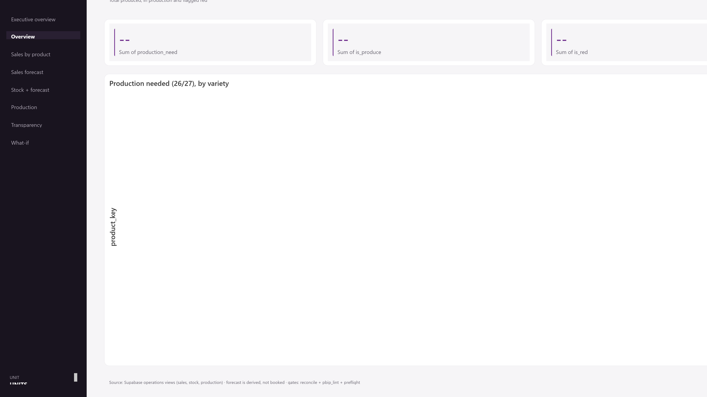
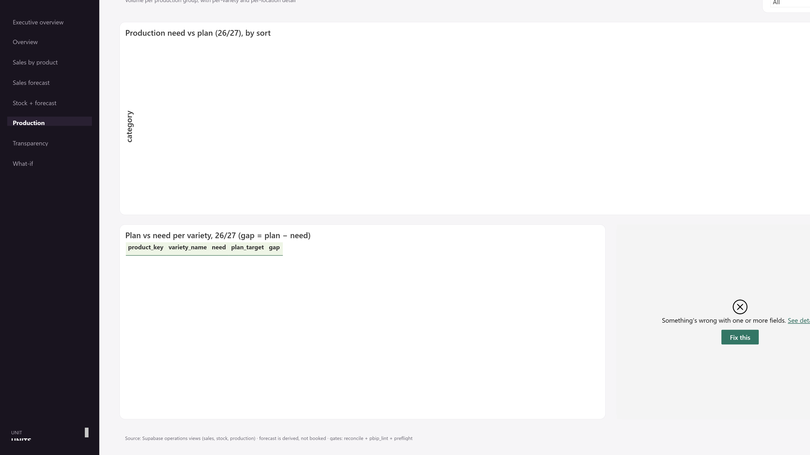

# Operations & Production Planning

> *A live system that tells a seed business what to produce, how much, and when. It reproduces the planner's own numbers exactly, checked against their spreadsheet on every build. A planning system with scenario testing, not a statistical forecast.*

Built as one SQL view in Postgres, recomputed whenever sales or stock land, with Power BI rendering the interface and running none of the logic. Validated against the planner's spreadsheet on every build.

**The numbers in this public folder are illustrative.** The validation result (that the engine reproduces the planner's spreadsheet with zero mismatches) is real; the per-variety quantities here are synthetic stand-ins for the confidential client data. Same logic, scrambled numbers.

## Situation: seed takes a year to grow, so a shortage is found twelve months too late

Production planning for 24 seed varieties ran on a spreadsheet the planner maintained by hand. Every sale and every stock movement made it stale, and the production decisions built on it inherited that staleness.

The lead time is what makes staleness expensive. You cannot react to a shortage of a variety, because making more takes about a year. You have to see it a year out. The planner was holding the whole triangle by hand: how much will we sell, how much do we have and how much is arriving, therefore how much must we start growing and when.

## Task: turn the planner's hand calculation into a system that is current and testable

The requirement was not a dashboard. It was a decision: which varieties will run short, and how much of each must be committed to now.

Three constraints shaped it. The output had to match the planner's own numbers exactly, or it would not be trusted and would not be used. It had to recompute the moment sales or stock changed, because a plan built on last week's stock is the problem being solved.

And it had to let the planner test a large order or a capacity drop before committing seed, without that test changing anything stored.

## Action: built the engine as one SQL view and kept Power BI out of the logic

**I built the engine as one SQL view, not DAX.** A production plan is stateful and has to recompute the instant data lands. In Postgres it is correct on arrival and testable on its own; in DAX it would recompute per visual and be untestable outside the report. Power BI renders the marts and runs nothing of consequence.

The whole calculation is three lines:

```sql
GREATEST(prod_safety + expected_sales - stock_on_hand - incoming, 0) AS production_need,
stock_on_hand + incoming - expected_sales                            AS ending_stock,
CASE WHEN NOT active THEN 'stopped'
     WHEN stock_on_hand + incoming - expected_sales < red_threshold THEN 'red'
     ELSE 'green' END                                                AS status
```

Produce enough to clear the safety buffer, never less than zero. Red when ending stock falls below the red line.

**Separated the warning from the order.** A variety can be red and still need zero production, because it covers its own expected sales. The system shows both numbers, so a warning light is never mistaken for a production instruction.

**Enforced the spreadsheet match in code rather than asserting it.** A gate checks the engine against known-good anchor varieties from the planner's sheet: exact ending stock, exact status, exact production need.

```python
want = {
    "VAR-A": {"ending_stock": 943.03,  "status": "green", "production_need": 0},
    "VAR-B": {"ending_stock": 47.48,   "status": "red",   "production_need": 0},
    "VAR-C": {"ending_stock": -134.15, "status": "red",   "production_need": 134.15},
    "VAR-D": {"ending_stock": 2283.52, "status": "green", "production_need": 0},
}
```

`VAR-B` is the anchor that proves the model reasons correctly: below the safety line, production need zero.

**Made scenarios read-only.** The what-if sliders are the one place logic lives in DAX, and they write nothing back. A disconnected parameter table feeds a measure that re-applies a sales uplift to the base SQL identity. A real commit goes back through the SQL layer and appends a snapshot.



*Total to produce, varieties needing production, and varieties at risk, with the quantity per variety. The planner's red and green sheet, made live. The real Power BI report, rendered against the fictive demo dataset.*

## Result: zero mismatches against the planner's sheet, enforced on every build

The engine reproduces the planner's spreadsheet with zero mismatches on the anchor varieties, and that result is a build gate rather than a one-time check. The gate also verifies that forecast channels sum exactly to each variety's expected sales, and that committing a plan appends a new snapshot instead of overwriting history. If an anchor moves, the build fails before the dashboard ships.

Planning moved off the spreadsheet onto a report covering sales, forecast, stock projection, production, data quality and scenarios.

The scenario layer answers a question the spreadsheet could not: what a large order or a capacity cut does to production need, before seed is committed for a year.

What changed for the planner is smaller than it sounds and matters more. The plan is no longer something maintained. It is something read.



*Computed need beside the planner's own batch target, so the gap between "just enough" and the planner's lot size is visible rather than buried, with per-variety and per-location detail below. The real Power BI report, rendered against the fictive demo dataset.*

## What it does not do

**Production is never measured.** `implied_production` is inferred from stock movement. When stock rises with no recorded arrival, the system attributes the difference to production. That is an inference, and where it comes out negative the transparency page flags it rather than absorbing it.

**Stock history is two observations.** Everything drawn between them is interpolation. The line looks like a trend and is not one. It is two audited year-ends with a straight line between them.

**The safety buffer is unseeded.** `safety_floor` and `safety_months` have no per-variety values yet, so the engine currently produces just enough not to go negative rather than a real batch size. Setting them is a growing decision, not a modelling one I can make.

**Year two is built and unvalidated.** The multi-year view's first year is checked against the live plan. The recursion beyond it runs but has never been validated, because only one sales year is seeded.

**This is not statistical forecasting.** The business runs on named deals, not predictable trends, so the system tests scenarios a human proposes. It does not predict.

## The design was reverse-engineered, not invented

The palette comes from evidence, using Playwright to read computed styles off the company site plus pixel-sampling the logo. It replaced a theme built on `#2E7D32`, a Material Design green that appears nowhere in the brand.

Two conventions do real work. **Solid means observed, dashed means projected**, applied on every chart that crosses from history into forecast. The stock chart originally had this inverted, dashing the audited series and drawing the projections solid, which claimed more confidence about the future than the past. And **colour carries meaning, not series order**: Power BI assigns series colours from a single-hue ramp, so the four-series stock projection first rendered as four near-identical purples stacked on each other. Actual, plan, risk and threshold now each hold a fixed colour, and forecast is dashed as well as amber so the distinction never rests on colour alone.

The brand font is Open Sans. Power BI cannot embed fonts, so the reports render in Segoe UI.

## What's in this folder

- `sql/` the production-planning schema and the `v_production_plan` view (the engine)
- `python/` the validation gate and a synthetic-data generator
- `powerbi/` dashboard spec and the one allowed what-if DAX measure
- `slides/` `deck-spec.md`

## A note on the client

A real engagement with a real seed company. All variety codes and quantities in the public files are illustrative stand-ins. The architecture and the validation method are described exactly as built.
