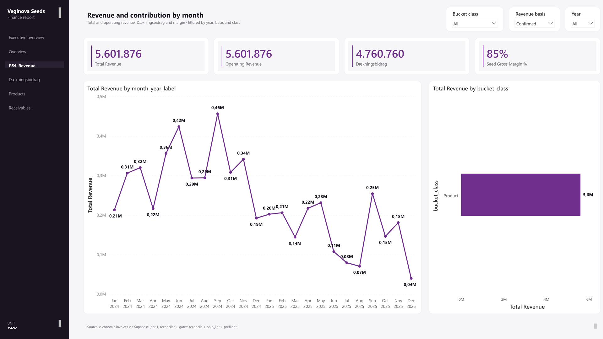
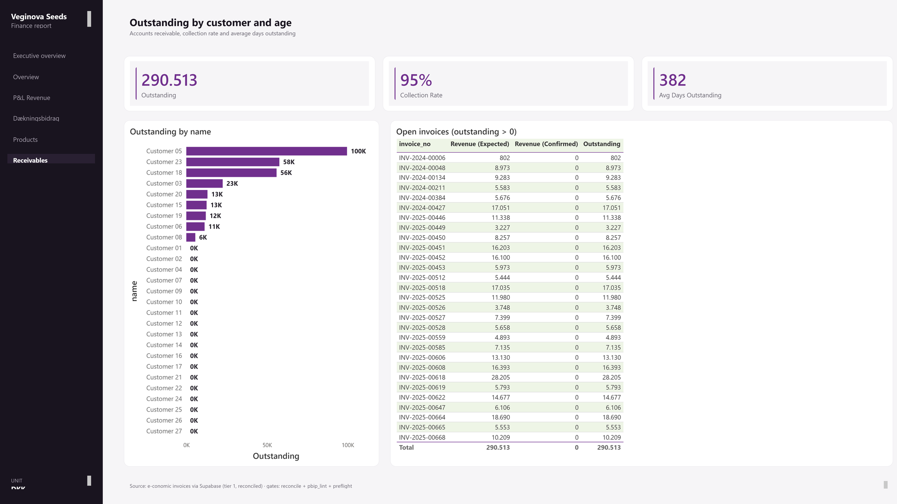

# Invoice & Financial Dashboard

> *Profit per product, profit per customer, and the cash owed, built from invoices and tied to the official accounts within 1.25%. Logic in SQL, Power BI renders only.*

Built as a star schema in Postgres at invoice-line grain, with the reconciliation gate in Python and Power BI rendering thin measures over columns the pipeline already computed.

**The reconciliation method and its result are real** (2024 invoice revenue ties to the audited ledger within 1.25%, with the unexplained remainder inside a 0.5% tolerance). **Every absolute figure shown here is illustrative**, including the ledger amount in the code below: per-product margins, customer profitability and receivables carry the shape and scale of the real findings with the confidential numbers replaced.

## Situation: the accounts and the invoices disagreed, and nobody could say by how much

A Danish seed company kept its numbers in two places that did not reconcile. The official accounts were structured for tax reporting, which hid the commercial picture: which varieties made money, which customers were worth keeping, and how much cash sat in unpaid invoices.

Every commercial conversation stalled on the same question of which source to believe. Pricing decisions and credit decisions were being made on numbers nobody would defend.

## Task: produce one revenue figure the owner would sign his name to

The deliverable was a dashboard, but the actual requirement was narrower and harder. One revenue number, reconciled to the audited ledger, with the gap between the two sources explained line by line rather than waved at.

Three constraints came with it. It had to run on the existing e-conomic export, with no new bookkeeping process. It had to survive a fresh data load without silently drifting.

And it had to attribute cost per variety, which the accounts do not do at all.

## Action: made the invoices the source and the accounts the cross-check

I made that call first, and it shaped everything after it. Invoices record what was actually sold, to whom, at what price. The tax accounts stopped being the source of truth and became the check on it.

**Modelled at invoice-line grain.** `fct_revenue` sits at line grain with four dimensions (`dim_date`, `dim_customer`, `dim_product`, `dim_bucket`), plus a disconnected `ref_revenue_basis` table driving an Expected / Confirmed / Recognized toggle. Keeping attributes on the dimensions means any measure cuts by product, customer or bucket without a new query.

**Put the logic in Postgres and left Power BI thin.** Cost attribution, the paid flag and the reconciliation all happen upstream, so every figure on screen traces to a reconciled row rather than to a measure that recomputes it. The three headline measures read in one line each:

```dax
Revenue =
SWITCH(
    SELECTEDVALUE('ref_revenue_basis'[basis], "Expected"),
    "Expected",   SUM(fct_revenue[amount_dkk_expected]),
    "Confirmed",  SUM(fct_revenue[amount_dkk_confirmed]),
    "Recognized", CALCULATE(SUM(fct_revenue[amount_dkk_expected]),
                  USERELATIONSHIP(dim_date[date_key], fct_revenue[recognition_date]))
)
Dækningsbidrag = [Revenue] - [COGS]                             // contribution margin
Outstanding    = [Revenue (Expected)] - [Revenue (Confirmed)]   // receivables
```

**Built a gate that separates explained divergence from unexplained divergence.** Documented FX and timing differences are subtracted before the tolerance is applied, so only the genuinely unaccounted remainder has to clear it:

```python
LEDGER_PRIMAER_2024    = 2312690.21   # official 2024 primær revenue (illustrative value shown)
RECONCILING_ITEMS_2024 = 28805.41     # documented EU FX / timing
UNEXPLAINED_TOL        = 0.005        # 0.5% gate on the unexplained remainder

residual    = LEDGER_PRIMAER_2024 - invoice_revenue_2024
unexplained = residual - RECONCILING_ITEMS_2024
ok = abs(unexplained) / LEDGER_PRIMAER_2024 <= UNEXPLAINED_TOL   # OK / FAIL
```

That distinction is the difference between "roughly right" and "every krone of the gap is accounted for".



*Total and operating revenue, Dækningsbidrag and margin, with revenue by month beside revenue by bucket. The real Power BI report, rendered against the fictive demo dataset.*

## Result: 2024 revenue tied to the audited figure within 1.25%, and it stays tied

The reconciliation holds against the official 2024 primær figure to within 1.25%, with the residual split into documented FX and timing items and an unexplained remainder inside a 0.5% tolerance.

The gate runs on every load. A future ingestion that breaks the tie fails the build before the number reaches a chart, which means the dashboard cannot quietly go wrong between reviews.

Contribution margin per variety now exists, which it did not before in any system. Receivables are visible by customer and by age.

The owner can answer "which varieties actually pay for themselves" without opening the bookkeeping system, and defend the answer to an accountant.



*Accounts receivable: what is owed, the collection rate, and days outstanding, by customer and by invoice. The real Power BI report, rendered against the fictive demo dataset.*

## What it does not do

The parts a buyer should know before believing the rest.

**It measures contribution margin, not profit.** Revenue minus the direct cost of the seed. Overhead stays in the bookkeeping system, because rebuilding it here would duplicate the official accounts. Contribution tells you which varieties carry the business. It does not tell you whether the business made money.

**Part of the forward view rests on a price assumption.** Forecast revenue is derived at historical prices and is not booked. It is labelled as derived everywhere it appears.

**There is a gap in 2026.** Invoices for January to July 2026 are not loaded, so any period crossing that window is incomplete rather than zero. The report states this on the page, not in a footnote.

**A chatbot was specified and I refused to build it.** The proposed design reached the database through a `service_role` key and an `exec_sql` wrapper capable of running `DROP`. A natural-language layer with that much authority is one prompt away from dropping a table, and no amount of prompt filtering fixes a permission model. It needs a read-only role and a query allow-list first. That work has not been done, so the feature does not exist.

## The design was reverse-engineered, not invented

The previous theme ran on `#2E7D32`, a Material Design green that appears nowhere in the company's brand. Someone had picked a green that looked agricultural. Clients notice that kind of detail and quietly stop trusting the rest.

The current palette comes from evidence: Playwright reading computed styles off the company site, plus pixel-sampling the logo, giving `#782B90` and `#006140` with a source for each.

Green stays semantic, meaning favourable or on-plan, and is deliberately kept off neutral chart series so it can never be misread as "good". Red is reserved for one meaning: a threshold or a breach.

The brand font is Open Sans. Power BI cannot embed fonts, so the reports render in Segoe UI. A mockup in a font the report cannot render is a lie the client approves.

## What's in this folder

- `sql/` the star-schema definition and the analytical queries
- `python/` the reconcile gate, the ingestion loader, and a synthetic-data generator
- `powerbi/` dashboard spec and the basis-toggle DAX
- `slides/` `deck-spec.md`

## A note on the client

A real engagement. All customer identifiers, invoice numbers, and absolute commercial amounts in the public files are illustrative stand-ins. The reconciliation method and its outcome are described exactly as built.
